# Pech

<p align="center">
  
</p>

<p>
  <a href="LICENSE"></a>
  
  
  
  
  <a href="https://www.repostatus.org/#wip"></a>
</p>

> **An @enchanter-ai product — algorithm-driven, agent-managed, self-learning.**

The cost ledger for AI-assisted development that learns from every session.

**5 sub-plugins. 5 engines. Per-tier attribution. Event-bus peer degradation. One command.**

> You just ran `/converge` on a Sonnet-heavy prompt. Pech saw 47 calls: Opus orchestrator ($0.06), Sonnet executor over 40 iterations ($2.12), Haiku validator ($0.003). L1 forecast projected end-of-month at $48.20 with ±$3 band against your $50 ceiling. At 80% of the session budget, L2 fired `pech.budget.threshold.crossed` — Wixie read the event and dropped `/converge` to Haiku for the next round; Sylph deferred PR polish. L3 flagged iteration 32 as a 3.8σ spike over your rolling mean, cache-hit ratio had fallen from 78% to 12% mid-loop. L5 remembered.
>
> Time: zero developer interruption. Budget preserved. Cache regression surfaced before it compounded.

## TL;DR

**In plain English:** Your monthly AI bill is one big number. Which plugin? Which model? Which prompt? Pech itemizes every dollar by tier and cache hit so you can fix the leak instead of guessing.

**Technically:** L1 Exponential Smoothing (α=0.3) forecasts session, daily, and monthly spend with a ±2σ confidence band; L2 Budget Boundary Detection fires `pech.budget.threshold.crossed` events at 50/80/100% per scope so peer plugins can degrade before the ceiling is hit; L3 Z-Score anomaly detection flags per-(attribution tuple) spikes at `|y − μ| > 3σ` over a 30-call rolling window. Every ledger row carries the `ENCHANTED_ATTRIBUTION` tuple (plugin, sub-plugin, skill, agent_tier, model) set at dispatch time, making per-tier cost answerable rather than opaque.

## Origin

**Pech** takes its name from **Thaumcraft** — short hooded hoarders that wander magical biomes picking up every dropped item and stuffing it into the packs on their backs, never losing track of what they carry. Pech keeps the same ledger discipline: every token, every tier, every pricing change accounted for.

The question this plugin answers: *What did it cost?*

## Who this is for

- Teams who need *"where did the budget go?"* in per-plugin / per-tier / per-model granularity, not a single "org total" line.
- Developers on a personal budget who want honest spend forecasts with confidence bands instead of dashboards that optimize for looking good.
- Engineers who want peer plugins (Wixie, Sylph, Emu) to **degrade** — not crash — when spend crosses a threshold.

Not for:

- Users satisfied with Anthropic's console for spend — if parent-thread aggregation is enough, Pech's attribution is overkill.
- Closed-cloud teams who can't run local JSONL ledgers — Pech is machine-local by design.

## Contents

- [How It Works](#how-it-works)
- [What Makes Pech Different](#what-makes-pech-different)
- [The Full Lifecycle](#the-full-lifecycle)
- [Install](#install)
- [Quickstart](#quickstart)
- [5 Sub-Plugins, 5 Engines, 4 Slash Commands](#5-sub-plugins-5-engines-4-slash-commands)
- [What You Get Per Session](#what-you-get-per-session)
- [Roadmap](#roadmap)
- [The Science Behind Pech](#the-science-behind-pech)
- [vs Everything Else](#vs-everything-else)
- [Agent Conduct (12 Modules)](#agent-conduct-12-modules)
- [Architecture](#architecture)
- [Acknowledgments](#acknowledgments)
- [Versioning & release cadence](#versioning--release-cadence)
- [Contributing](#contributing)
- [Citation](#citation)
- [License](#license)

## How It Works

Pech doesn't just track spend. It **attributes** — every token, every prompt-cache hit, every tool-use turn gets tagged with the plugin / sub-plugin / skill / agent tier / model that fired it. Then it forecasts with honest confidence bands, detects anomalies against your personal rolling mean, and publishes threshold events so peer plugins can **degrade themselves** before you hit the ceiling.

The core innovation is the **attribution contract**: every enchanter-ai sibling that dispatches work sets the `ENCHANTED_ATTRIBUTION` environment variable before the call. Pech reads it at `PostToolUse`, looks up the model in `shared/rate-card.json`, applies the prompt-cache modifiers (writes at 1.25×, reads at 0.1×, batch at 0.5×), and writes a ledger row. What Anthropic's console shows as one line of "org total" becomes thirty lines of per-plugin-per-tier-per-model reality.

The diagram below shows the six-subplugin architecture: a Claude Code session passes through `rate-limiter` (token-bucket runaway-loop detection at PreToolUse), then flows into `cost-tracker` (L1 + L4 — the primary PostToolUse hook consumer), which feeds `budget-watcher` (L2 + L3 — threshold + anomaly detection) and `nook-learning` (L5 — cross-session pattern accumulation). `rate-card-keeper` holds the committed rate card; `cost-query` is the skill-invoked developer surface. Events hit the enchanted-mcp bus only on threshold crossings, anomalies, rollups, and bucket-empty advisories — peer plugins (Wixie, Sylph, Emu) subscribe and degrade gracefully.

<p align="center">
  <a href="docs/assets/pipeline.mmd" title="View pipeline source (Mermaid)">
    
  </a>
</p>

<sub align="center">

Source: [docs/assets/pipeline.mmd](docs/assets/pipeline.mmd) · Regeneration command in [docs/assets/README.md](docs/assets/README.md).

</sub>

No permission prompts. No manual ledgering. You work; Pech observes, tags, forecasts, and alerts.

## What Makes Pech Different

### It attributes per agent tier, not per parent thread

A single Wixie `/converge` run chains Opus (orchestrator, ~$0.06) → Sonnet (executor loop, ~$2.00) → Haiku (validator, ~$0.003). Naïve attribution — what Anthropic's console does — buckets all of it under the parent thread. Opus looks 30× costlier than it is; Sonnet looks free. Pech's `ENCHANTED_ATTRIBUTION.agent_tier` field is set at dispatch time, so every token lands in its actual tier's bucket. **This is what makes `$50/month on Claude Code` answerable.**

### Peer plugins degrade from its threshold events

When L2 fires `pech.budget.threshold.crossed` at 80%, the enchanted-mcp bus delivers it to every subscribed sibling. Wixie switches to Haiku for validator-only roles. Sylph defers PR polish to next session. Emu trims context more aggressively. The next 20% of budget buys you careful degradation instead of a silent overrun or a hard kill.

External tools can't do this. Anthropic's console fires email alerts. LangSmith sends Slack notifications. Neither can make *your other plugins* react, because they don't own the peer plugins.

### It surfaces cache waste as dollars, not as a performance metric

Prompt caching is the single biggest lever in Claude Code cost today — and the most opaque. L4 Cache-Waste Measurement tracks cache writes that never get read within the session (1.25× input rate spent for nothing) and reports it in dollars. No other tool does this.

```
Pech cache report (session)
  Hit ratio:              78%
  Read savings:           $0.42 (at 0.10× rate)
  Unread writes:          $0.04 (1.25× rate × 32 tokens)
  Net benefit:           +$0.38
```

### It forecasts honestly

Every L1 forecast ships with its ±2σ confidence band. Point estimates without bands are banned. A forecast that says "$48 end-of-month ±$12" is useful; a forecast that says "$48" is misleading. Honest numbers are the product.

### It remembers your patterns across sessions

L5 Gauss Learning persists per-developer spend patterns — `mu` and `sigma` per `(plugin, skill, agent_tier)` — at a slow α=0.05 update rate so one noisy session doesn't skew the history. When L3 anomaly detection runs on a fresh session with only 5 observations, it falls back to this historical prior. That's how you get "this `/converge` run at $0.80 is 3.3× your rolling mean" on call #6, not call #30.

### It runs zero-cloud

Brand invariant: hooks are bash+jq, scripts are Python stdlib. No external runtime dep. Your ledger lives in `plugins/cost-tracker/state/ledger-YYYY-MM.jsonl` on your disk. Rate card is committed JSON refreshed by nightly CI, not an HTTP fetch on the hot path. Cost data never leaves the machine.

## The Full Lifecycle

A call flows through Pech in four stages moving top to bottom: **SessionStart** (Haiku) loads the committed rate card and mints the session ID; **PostToolUse** (Haiku, repeated per tool call) parses API usage + attribution env, writes the ledger row, then runs L2 threshold + L3 anomaly detection; **PreCompact** (Sonnet) persists per-developer spend patterns via L5's slow α=0.05 accumulator before compaction wipes in-memory state; **Stop** (Haiku) finalizes the daily rollup and emits `pech.session.cost.finalized`. Throughout, the developer can pull spend state on-demand via `/pech-{cost,forecast,attribute,report}` — the query surface is orthogonal to the observation path.

<p align="center">
  <a href="docs/assets/lifecycle.mmd" title="View lifecycle source (Mermaid)">
    
  </a>
</p>

<sub align="center">

Source: [docs/assets/lifecycle.mmd](docs/assets/lifecycle.mmd) · Regeneration command in [docs/assets/README.md](docs/assets/README.md).

</sub>

Every stage is autonomous; the developer surface is pull, not push.

## Install

Pech ships as a 5-sub-plugin marketplace. One meta-plugin — `full` — lists all five as dependencies, so a single install pulls in the whole chain.

**In Claude Code** (recommended):

```
/plugin marketplace add enchanter-ai/pech
/plugin install full@pech
```

Claude Code resolves the dependency list and installs all 5 sub-plugins. Verify with `/plugin list`.

**Want to cherry-pick?** Individual sub-plugins are still installable — e.g. `/plugin install cost-tracker@pech` if you only want the ledger and no threshold alerts. Missing sub-plugins degrade gracefully (cost-query without cost-tracker shows "no observations yet"; budget-watcher without rate-card-keeper refuses to observe).

**Via shell** (also clones locally so `shared/scripts/*.py` are available):

```bash
bash <(curl -s https://raw.githubusercontent.com/enchanter-ai/pech/main/install.sh)
```

## Quickstart

```bash
git clone https://github.com/enchanter-ai/pech
cd pech
./scripts/bootstrap.sh    # canonical first command — installs vis sibling
```

Without `./scripts/bootstrap.sh`, conduct imports will silently miss and Claude Code's `@`-loader will fail-soft. Always bootstrap first.
## 6 Sub-Plugins, 5 Core Engines, 4 Slash Commands

Five **core sub-plugins** (cost-ledger lineup) plus one **cost-control utility** (`rate-limiter`, added 2026-05-05) for runaway-loop detection. License compliance (`license-gate`) and SBOM emission (`sbom-emitter`) live in [hydra](https://github.com/enchanter-ai/hydra) — they are supply-chain / compliance concerns, not cost.

| Sub-plugin | Owns | Trigger | Agent |
|------------|------|---------|-------|
| [cost-tracker](plugins/cost-tracker/) | L1 Exponential Smoothing + L4 Cache-Waste | hook-driven (PostToolUse) | forecaster (Sonnet) |
| [budget-watcher](plugins/budget-watcher/) | L2 Budget Boundary + L3 Z-Score Anomaly | hook-driven (PostToolUse) | threshold-auditor (Haiku) + anomaly-triager (Opus) |
| [rate-card-keeper](plugins/rate-card-keeper/) | rate card + staleness | hook-driven (SessionStart) | rate-card-validator (Haiku) |
| [nook-learning](plugins/nook-learning/) | L5 Gauss Learning (Pech) | hook-driven (PreCompact) | pattern-learner (Sonnet) |
| [cost-query](plugins/cost-query/) | developer slash commands | skill-invoked | report-narrator (Opus) |
| **[rate-limiter](plugins/rate-limiter/)** | Token-bucket runaway-loop detection | hook-driven (PreToolUse) | (advisory hook) |

Slash commands from `cost-query`:

| Command | Function | Agent tier |
|---------|----------|------------|
| `/pech-cost [--session\|--day\|--month]` | Current spend with attribution breakdown | Haiku |
| `/pech-forecast [--session\|--day\|--month]` | L1 projection with ±2σ band | Sonnet |
| `/pech-attribute [--last=N] [--tool=<name>]` | Break down last N calls by any axis | Haiku |
| `/pech-report` | Dark-themed PDF audit with Opus anomaly narrative | Opus + Sonnet |

## What You Get Per Session

Tool calls flow through five journals — one per state-bearing sub-plugin — and converge on the enchanted-mcp bus (threshold + anomaly + rollup + rate-bucket events) and the developer query surface. Hook fires at the top; journals in the middle; bus + query at the bottom. The five border colors map engines to journals: yellow = rate-card-keeper · coral = rate-limiter (token bucket) · blue = cost-tracker (L1 + L4) · red = budget-watcher (L2 + L3) · purple = nook-learning (L5).

<p align="center">
  <a href="docs/assets/state-flow.mmd" title="View state-flow diagram source (Mermaid)">
    
  </a>
</p>

<sub align="center">

Source: [docs/assets/state-flow.mmd](docs/assets/state-flow.mmd) · Regeneration command in [docs/assets/README.md](docs/assets/README.md).

</sub>

## Roadmap

Tracked in [docs/ROADMAP.md](docs/ROADMAP.md) and the shared [ecosystem map](docs/ecosystem.md). For upcoming work specific to Pech, see issues tagged [roadmap](https://github.com/enchanter-ai/pech/labels/roadmap).

```
plugins/cost-tracker/state/
├── ledger-2026-04.jsonl      Append-only per-call rows with full attribution
├── session.json              Current session snapshot (for status line)
└── rollups/
    └── daily-2026-04-19.json Daily pre-aggregated rollup (forever retention)

plugins/budget-watcher/state/
├── budgets.json              Per-scope ceilings (developer config)
├── counters.json             Running per-scope totals
├── thresholds.jsonl          Debounce state + audit trail of every crossing
└── anomalies.jsonl           L3 detection log

plugins/nook-learning/state/
└── learnings.json            Per-developer patterns (α=0.05 accumulated)

plugins/rate-limiter/state/
└── buckets.json              Per (session, skill) token bucket — runaway-loop advisory

shared/
├── rate-card.json            Per-model rates + modifiers (committed, CI-refreshed)
└── learnings.json            Cross-plugin exported patterns
```

The **PDF audit report** from `/pech-report` includes: session total + forecast band, attribution pie (plugin × tier × model), L2 threshold-crossing timeline, L3 anomaly list with Opus-narrated diagnoses, L4 cache-waste breakdown, L5 delta from your rolling mean.

## The Science Behind Pech

Every Pech engine is built on a formal mathematical model. Full derivations in [`docs/science/README.md`](docs/science/README.md).

### Engine L1: Exponential Smoothing Forecast

<p align="center"></p>

<p align="center"></p>

Weighted moving average over the ledger's per-call cost series. Three horizons (session, day, month). Confidence band computed from residual variance — a single-value point estimate without band is banned. α is configurable but α=0.3 balances responsiveness against noise for typical Claude Code session cadence.

### Engine L2: Budget Boundary Detection

<p align="center">= threshold AND (threshold, scope, key) not in debounce"></p>

Per-scope counters maintained across (session, hour, day, month) × (agent tier) × (model). Thresholds at 50/80/100%. Debounce is mandatory: once `(threshold, scope, scope_key)` fires, it does not re-fire within that window. Without debounce, N calls past the threshold would produce N events — floods the bus and trains the developer to mute.

### Engine L3: Z-Score Cost Anomaly

<p align="center"> 3"></p>

Rolling μ and σ computed over the last 30 calls matching the same `(plugin, sub_plugin, skill, agent_tier, model)` tuple. For sessions with N<30, falls back to L5's persisted historical prior. Alerts on both **spikes** (unusual cost increase — the common case) and **drops** (signals cache-hit wins or rate-card drift — also worth surfacing). Uses population stdev, not sample: we have the full observed window, not a sample from a larger population.

### Engine L4: Cache-Waste Measurement

<p align="center"></p>

Where `R`, `W`, `M` are cache read / write / miss token counts; `W_unread` is the subset of writes with no downstream read in the session; `r_input` is the input rate; `c_write = 1.25` is the cache-write modifier. Surfaces the dollar cost of prompt-cache misses as a first-class signal, not a performance-table afterthought.

### Engine L5: Gauss Learning (Pech)

<p align="center"></p>

Slow accumulator: one noisy session barely moves learned μ and σ. Update runs at PreCompact per `(plugin, skill, agent_tier)` attribution key. Persisted in `state/learnings.json` with Emu-A4 atomic serialization (write-to-tmp + fsync + rename). Exported to `shared/learnings.json` under the `pech` section so peer plugins can read Pech's knowledge for their own cost-aware judgments.

---

*The math runs as code in [`shared/scripts/`](shared/scripts/). Every script is stdlib-only per brand invariant.*

## vs Everything Else

| | Pech | Anthropic Console | LangSmith | Helicone | PromptLayer |
|---|---|---|---|---|---|
| Per-plugin attribution | ✓ | — | partial | partial | — |
| Per-agent-tier attribution (Opus/Sonnet/Haiku in one chain) | ✓ | — | — | — | — |
| Per-skill attribution | ✓ | — | partial | — | — |
| Prompt-cache write/read separation | ✓ | summary | — | partial | — |
| Cache-waste detection (unread writes) | ✓ | — | — | — | — |
| Forecasts with honest confidence bands | ✓ | — | — | — | — |
| Threshold events to peer plugins | ✓ | — | — | — | — |
| Z-score anomaly detection | ✓ | — | — | — | — |
| Cross-session learning | ✓ | — | — | — | — |
| Batch API discount tracking | ✓ | ✓ | — | ✓ | — |
| Runs locally, zero cloud egress | ✓ | cloud | cloud | cloud | cloud |
| Dependencies | bash + jq + stdlib | — | Python SDK | Python SDK | SaaS |
| Price | Free (MIT) | included | $$ | $$ | $$$ |

## Agent Conduct (12 Modules)

Every skill inherits a reusable behavioral contract from [shared/vis/conduct/](shared/vis/conduct/) — loaded once into [CLAUDE.md](CLAUDE.md), applied across all plugins. This is how Claude *acts* inside Pech: deterministic, surgical, verifiable. Not a suggestion; a contract.

| Module | What it governs |
|--------|-----------------|
| [discipline.md](../vis/packages/core/conduct/discipline.md) | Coding conduct: think-first, simplicity, surgical edits, goal-driven loops |
| [context.md](../vis/packages/core/conduct/context.md) | Attention-budget hygiene, U-curve placement, checkpoint protocol |
| [verification.md](../vis/packages/core/conduct/verification.md) | Independent checks, baseline snapshots, dry-run for destructive ops |
| [delegation.md](../vis/packages/core/conduct/delegation.md) | Subagent contracts, tool whitelisting, parallel vs. serial rules |
| [failure-modes.md](../vis/packages/core/conduct/failure-modes.md) | 14-code taxonomy for `state/learnings.json` so L5 Gauss Accumulation compounds |
| [tool-use.md](../vis/packages/core/conduct/tool-use.md) | Tool-choice hygiene, error payload contract, parallel-dispatch rules |
| [formatting.md](../vis/packages/skills/conduct/formatting.md) | Per-target format (XML / Markdown sandwich / minimal / few-shot), prefill + stop sequences |
| [skill-authoring.md](../vis/packages/skills/conduct/skill-authoring.md) | SKILL.md frontmatter discipline, discovery test |
| [hooks.md](../vis/packages/core/conduct/hooks.md) | Advisory-only hooks, injection over denial, fail-open |
| [precedent.md](../vis/packages/core/conduct/precedent.md) | Log self-observed failures to `state/precedent-log.md`; consult before risky steps |
| [tier-sizing.md](../vis/packages/core/conduct/tier-sizing.md) | Prompt verbosity scales inversely with model tier; Haiku needs mechanical steps, Opus runs on intent |
| [web-fetch.md](../vis/packages/web/conduct/web-fetch.md) | External URL handling: cache, dedup, budget; WebFetch is Haiku-tier-only |

## Architecture

Interactive architecture explorer with sub-plugin diagrams, agent cards, and event flow:

**[docs/architecture/](docs/architecture/)** — auto-generated from the codebase. Run `python docs/architecture/generate.py` to regenerate.

## Acknowledgments

Pech builds on substrate laid by others:

- **[Claude Code](https://github.com/anthropics/claude-code)** (Anthropic) — the plugin surface this work extends.
- **[Keep a Changelog](https://keepachangelog.com/)** — CHANGELOG convention.
- **[Semantic Versioning](https://semver.org/)** — versioning contract.
- **[Contributor Covenant](https://www.contributor-covenant.org/)** — Code of Conduct.
- **[repostatus.org](https://www.repostatus.org/)** — status badge.
- **[Citation File Format](https://citation-file-format.github.io/)** — citation metadata.
- **[Conventional Commits](https://www.conventionalcommits.org/)** — commit convention.

## Versioning & release cadence

Pech follows [Semantic Versioning](https://semver.org/spec/v2.0.0.html). Breaking changes land on major bumps only; the [CHANGELOG](CHANGELOG.md) flags them explicitly. Release cadence is opportunistic — tags land when accumulated fixes or features justify a cut, not on a fixed schedule. Migration notes between majors live in [docs/upgrading.md](docs/upgrading.md).

## Contributing

See [CONTRIBUTING.md](CONTRIBUTING.md).

## Citation

If you use this project in research or derivative work, please cite it:

```bibtex
@software{pech_2026,
  title = {Pech},
  author = {{Klaiderman}},
  year = {2026},
  url = {https://github.com/enchanter-ai/pech}
}
```

See [CITATION.cff](CITATION.cff) for additional formats (APA, MLA, EndNote).

## License

MIT — see [LICENSE](LICENSE).

---

## Role in the ecosystem

Pech is the **cost-ledger layer** (Phase 1, pre-release) — it tallies every token attributed to a specific plugin × sub-plugin × agent tier × model via the `ENCHANTED_ATTRIBUTION` environment variable. Upstream, every peer plugin that dispatches work (Wixie, Sylph, Emu, Lich) sets this variable before the call so Pech can apportion cost honestly. Downstream, Pech emits `pech.budget.threshold.crossed` events on the enchanted-mcp bus; peer plugins subscribe and **degrade gracefully** — Wixie drops to Haiku, Sylph defers polish, Emu trims context.

Pech does not engineer prompts (Wixie's lane), score change trust (Crow's lane), review code (Lich's lane), or pre-emptively kill dispatches to enforce budgets (the degradation model is cooperative, not coercive). It keeps the ledger honest.

See [docs/ecosystem.md § Data Flow Between Plugins](docs/ecosystem.md#data-flow-between-plugins) for the full map.

---

Repo: https://github.com/enchanter-ai/pech
